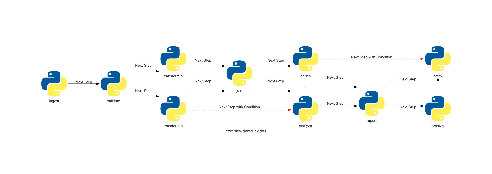

<div align="center">
  
  
  <h1>FluxCLI</h1>
  <p><em>Lightweight, CLI-first framework for building <strong>DAG-based workflows</strong></em></p>

  <p>
    <a href="https://www.python.org/"></a>
    <a href="https://github.com/ShaharBand/fluxcli"></a>
  </p>
</div>

---

FluxCLI lets you build and run structured, DAG-based workflows where each workflow becomes a **CLI command**. It's **local-first** for easy debugging and **portable** for orchestration.

---

!!! note "Complex workflow"
    <div align="center">
      
      <p><em>Clear representation of workflow DAG with branching and parallel execution.</em></p>
    </div>

---

## Key Features

- **CLI-based actions** – every node has a clear interface for inputs and outputs.
- **DAG-based workflows** – define arbitrary connections between tasks and their dependencies.
- **Highly structured workflows** – strict validation ensures safer pipelines, easier debugging, and predictable behavior.
- **Self-orchestrated nodes** – each node manages its own execution, retries, and dependencies.
- **Lightweight building blocks** – workflows are small, self-contained units that can each run in their own environment.
- **Extensible by design** – wrap workflows with your own classes to add logging, metrics, or integrations.
- **Local-first development** – debug and run workflows as simple CLIs, then scale them seamlessly to CI/CD or external orchestrators.

---

## Installation

!!! code "Install FluxCLI"
    ```bash
    pip install fluxcli
    ```

---

## Quick Start

### 1) Define workflow input

Create a typed `WorkflowInput`. These fields become CLI flags automatically.

!!! code "WorkflowInput Example"
    ```python
    from fluxcli.workflow import WorkflowInput

    class MyInput(WorkflowInput):
        message: str = "world"
    ```

### 2) Make nodes

Implement `Node` logic in `_logic()` and type-narrow `workflow_input` for convenience.

!!! code "Node Example"
    ```python
    from fluxcli.node import Node

    class Echo(Node):
        @property
        def workflow_input(self) -> MyInput:
            return self._workflow_input

        def _logic(self) -> None:
            self._logger.info(f"Echo: {self.workflow_input.message}")
    ```

### 3) Build a workflow

Create a `Workflow`, add nodes to it, and wire edges/conditions to express execution order and data dependencies.  
Workflows orchestrate retries, timeouts, and overall execution.

!!! code "Workflow Example"
    ```python
    from fluxcli.workflow import Workflow

    def build_workflow() -> Workflow:
        wf = Workflow(name="demo", description="Demo flow", version="0.1")

        # Nodes: demonstrate node-level timeout and retries
        alpha = Echo(name="alpha", description="prints a message", timeout_seconds=5, max_retries=1, retry_delay_seconds=1)
        beta = Echo(name="beta", description="prints after alpha")
        gamma = Echo(name="gamma", description="conditional step")

        # Register nodes to the workflow
        wf.add_node(alpha)
        wf.add_node(beta)
        wf.add_node(gamma)

        # Edges (ordering and conditions)
        wf.add_edge(alpha, beta)  # run beta after alpha
        wf.add_conditional_edge(beta, gamma, condition=lambda: True)  # example condition

        return wf
    ```

### 4) Wire into a CLI

Use `FluxCLI` to expose your workflow as a single command. CLI flags are auto-generated from your `WorkflowInput` fields (with types and defaults), so your interface stays consistent with your code.

!!! code "Expose Workflow via CLI"
    ```python
    from fluxcli import FluxCLI

    if __name__ == "__main__":
        cli = FluxCLI()
        wf = build_workflow()
        cli.add_command("my-workflow", wf, MyInput)
        cli.run()
    ```

Run it:

!!! code "Run the CLI"
    ```bash
    python cli.py my-workflow --message hello

    # discover generated flags and help text
    python cli.py my-workflow --help
    ```

---

## Where to go next

- Getting started: project layout, environment, and running the included demo — [Getting started](getting-started.md)  
- Core concepts: workflows, nodes, execution groups, orchestration controls, and node-to-node communication — [Core concepts](concepts.md)  
